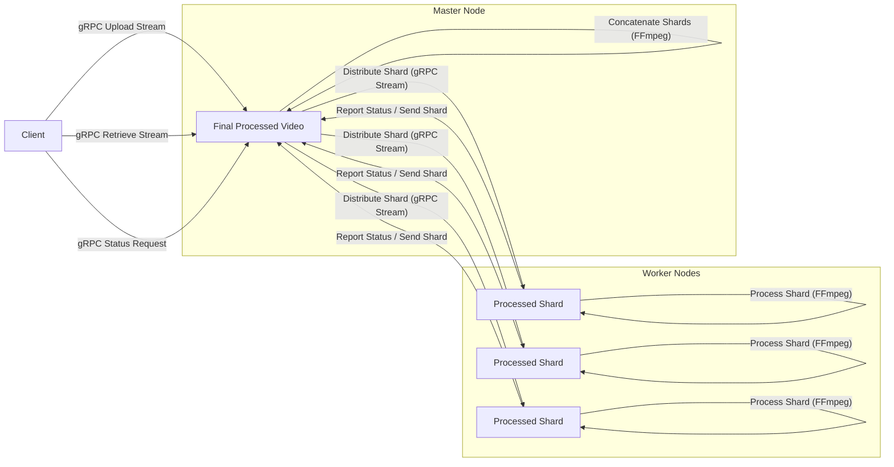

# Distributed Video Encoding System

This project implements a fault-tolerant distributed system for video encoding and processing (resizing, format conversion) using a master-worker architecture built with gRPC and FFmpeg.

## Features

- **Master-Worker Architecture:** Centralized master node coordinates tasks distributed to multiple worker nodes.
- **Fault Tolerance:**
  - Master retries distributing shards to available workers upon failure.
  - Master re-requests processed shards from workers if needed.
  - Basic heartbeating mechanism to monitor worker liveness.
- **Video Segmentation:** Videos are segmented into smaller shards (approximately 10 seconds each) based on keyframes using FFmpeg.
- **Parallel Processing:** Shards are distributed and processed concurrently by available worker nodes.
- **Video Processing:** Workers can resize video frames (`scale`) and change codecs/formats using FFmpeg.
- **Atomic Concatenation:** Processed shards are concatenated on the master node into the final video file using a temporary file and atomic rename to prevent partial writes.
- **Stream Copy (Optimized Concatenation):** Uses `ffmpeg -c copy` and `-copytb 1` where possible for fast, loss-less concatenation without re-encoding, preserving original timestamps.
- **Streaming Upload/Download:** Videos are uploaded and downloaded between the client and master using gRPC streaming.
- **Status Monitoring:** Client can poll the master for the current processing status of a video.
- **Dependency Management:** Setup script automates virtual environment creation and dependency installation.
- **Helper Scripts:** Scripts are provided for setting up the environment, starting master/worker nodes, running test clients, creating test videos, and cleaning up processes.

## Architecture



## Components

### `node.py`

This script serves as the core node logic, capable of running as either a master or a worker.

- **Roles:** `--role master` or `--role worker`.
- **Master Responsibilities:**
  - Receives raw video streams from clients.
  - Segments videos using FFmpeg.
  - Manages the state of each video processing job.
  - Distributes video shards to available workers.
  - Receives processed shards from workers.
  - Concatenates processed shards into the final video using FFmpeg.
  - Handles client requests for video status and retrieval.
  - Tracks worker liveness via heartbeats.
- **Worker Responsibilities:**
  - Receives video shards from the master.
  - Processes shards using FFmpeg based on target resolution and format.
  - Reports processing status back to the master.
  - Sends processed shards back to the master.
  - Sends heartbeats to the master.
- **FFmpeg Commands/Arguments:**
  - **Segmentation (Master):** Uses `force_key_frames="expr:gte(t,n_forced*10)"` to segment based on 10-second intervals.
  - **Processing (Worker):** Uses `vsync=passthrough` to maintain timestamps and standard arguments for scaling (`vf=scale=W:H`), video codec (`vcodec=libx264`), and audio codec (`acodec=aac`).
  - **Concatenation (Master):** Uses `ffmpeg -f concat -safe 0 -i filelist.txt -c copy -copytb 1 output.mkv/mp4`.

### `client.py`

This script provides the command-line interface for interacting with the distributed system.

- **Commands:**
  - `--upload <video_path>`: Uploads a video to the master.
  - `--retrieve <video_id>`: Downloads a processed video from the master.
  - `--status <video_id>`: Gets the current processing status of a video from the master.
- **Options:**
  - `--master <host:port>`: Specifies the master node address.
  - `--width <int>`, `--height <int>`: Target resolution for processing.
  - `--upscale-width <int>`, `--upscale-height <int>`: Optional upscale resolution.
  - `--format <mkv|mp4|webm|mov>`: Output video format.
  - `--output <path>`: Local path to save the processed video.
  - `--poll-interval <seconds>`: Polling interval for status checks.
  - `--poll-timeout <seconds>`: Timeout for polling status.
- **Streaming:** Implements gRPC streaming for efficient large file transfers during upload and retrieval.
- **Status Polling:** Automatically polls the master for status after upload if an output path is provided.

### Helper Scripts

The repository includes several bash scripts to simplify setup, execution, and testing.

- **`setup_env.sh`**:
  - Creates a Python virtual environment (`venv`).
  - Activates the virtual environment.
  - Upgrades pip.
  - Installs required Python dependencies (`grpcio`, `protobuf`, `grpcio-tools`, `psutil`).
  - Installs necessary system packages (`ffmpeg`, `x264`, `libx264-dev`, `mkvtoolnix`).
  - Compiles the `replication.proto` file into Python code using `grpc_tools.protoc`.
- **`start_master.sh`**:
  - Starts the `node.py` script in master mode on a specified host and port, listing the worker node addresses as peers.
- **`start_worker.sh`**:
  - Starts multiple instances of the `node.py` script, each in worker mode on a specific host and port.
  - Each worker is configured with the master node's address and the addresses of its peers (including the master and other workers).
- **`start_test_client.sh`**:
  - Provides example `client.py` commands demonstrating uploading videos with different processing parameters (downscaling, upscaling, format conversion to mkv) and specifying output files.
- **`create_test_video.sh`**:
  - Uses FFmpeg's built-in sources (`testsrc`, `sine`) to generate dummy MP4 video files (`test_video.mp4`, `test_video_large.mp4`) of specified durations and resolutions for testing.
- **`killscript.sh`**:
  - Finds and gracefully terminates running `node.py` processes.
  - Includes options to force kill if graceful shutdown fails.
  - Cleans up temporary FFmpeg concatenation directories in `/tmp`.
  - (Optional) Includes commented-out lines to clean up the `video_shards` and `master_data` directories.
    Setup

---

1.  **Clone the repository (if applicable):**

    ```
    # Replace with your repository URL
    git clone <repository_url>
    cd <repository_directory>

    ```

2.  **Run the setup script:**

    ```
    bash setup_env.sh

    ```

    This will create a virtual environment, install dependencies, and compile the `.proto` file.

3.  **Activate the virtual environment:**

    ```
    source venv/bin/activate

    ```

4.  **Create test videos (optional but recommended):**

    ```
    bash create_test_video.sh

    ```

## Usage

1.  **Start the master node:**

    ```
    bash start_master.sh

    ```

2.  **Start the worker nodes (in separate terminals):**

    ```
    bash start_worker.sh # This script typically starts multiple workers
    # Or start individual workers:
    # python node.py --role worker --host <worker_ip> --port <worker_port> --master <master_ip:master_port> --nodes <master_ip:master_port>,<other_worker1_ip:port>,...

    ```

3.  **Run a client command (in another terminal, with the virtual environment activated):**

    ```
    # Example: Upload and process a video
    python client.py --master localhost:50051 --upload ./test_video_large.mp4 --width 320 --height 240 --format mkv --output ./processed_video.mkv

    # Example: Just upload
    python client.py --master localhost:50051 --upload ./input.mp4 --width 640 --height 480 --format mp4

    # Example: Retrieve processed video
    python client.py --master localhost:50051 --retrieve test_video_large.mp4 --output ./downloaded_video.mkv

    # Example: Check status
    python client.py --master localhost:50051 --status test_video_large.mp4

    ```

4.  **To stop the system:**

    ```
    bash killscript.sh

    ```

## Directory Structure

- `replication.proto`: Protocol Buffers definition for gRPC services and messages.
- `node.py`: Master and worker node implementation.
- `client.py`: Client application for interacting with the system.
- `setup_env.sh`: Script to set up the environment and dependencies.
- `start_master.sh`: Script to start the master node.
- `start_worker.sh`: Script to start worker nodes.
- `start_test_client.sh`: Script with example client commands.
- `create_test_video.sh`: Script to create test video files.
- `killscript.sh`: Script to stop running nodes and clean up.
- `venv/`: Python virtual environment directory (created by `setup_env.sh`).
- `video_shards/`: Directory where master stores original video shards.
- `master_data/`: Directory where master stores retrieved processed shards and final processed videos.
- `master_data/retrieved_shards/`: Subdirectory for storing processed shards retrieved from workers.

## Potential Enhancements

- Implement a more robust leader election protocol (e.g., Raft).
- Improve worker failure detection and task re-assignment.
- Add support for more video codecs and processing options.
- Implement a web UI for monitoring and managing the system.
- Enhance error handling and logging.
- Implement persistence for video states to survive master restarts.
